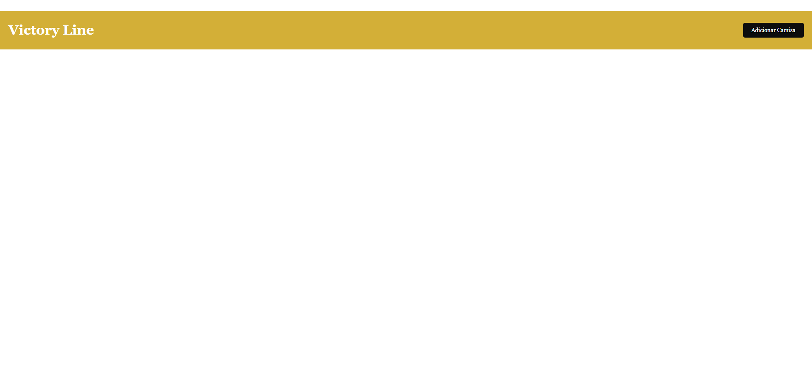
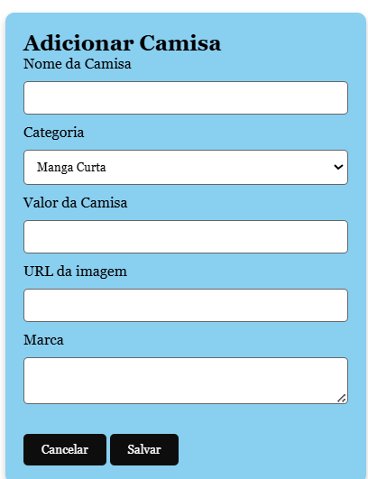

📘 Nome do Projeto

Breve descrição do projeto: explique em 2–3 linhas qual é o objetivo do sistema.

🛠️ IDE utilizada
Nome da IDE:  Visual Studio Code 
Versão (se aplicável): Ex: 2024.1

🗄️ SGBD e versão
Sistema de Gerenciamento de Banco de Dados: MySQL 
Versão: Ex: MySQL 8.0
Xampp
Prisma

💻 Linguagens utilizadas
Ex: JavaScript

🖼️ Prints das telas

Prints do site base:

Tela Quartos
| |  "Site base da Loja de Camisa" 

🚀 Passo a passo de execução do projeto
2. Clonar o repositório
git clone https://github.com/Luis-cloud356/Atividade_Hotel.git
3. Configurar o banco de dados
4. Utilizar os codigos, npx prisma migrate dev
5. Executar o projeto
Abrir o projeto na IDE
Iniciar o servidor de aplicação
